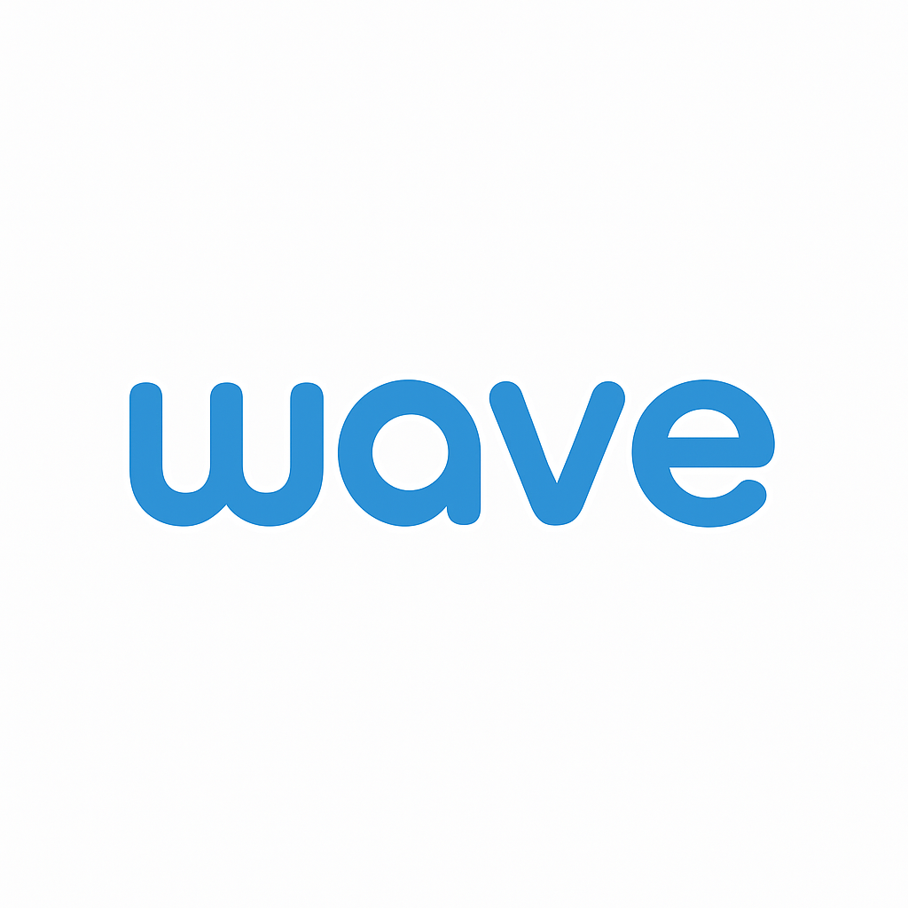

# Wave



Wave is a desktop application that allows you to control your computer using hand gestures detected through your webcam. Create custom macros, map them to specific hand gestures, and execute commands without touching your keyboard or mouse.

## Features

- **Real-time Hand Gesture Detection**: Detects gestures like open hand, pinched fingers, OK sign, peace sign, point up, point down, thumbs up, and thumbs down
- **Custom Macro Creation**: Create sequences of actions that can be triggered by gestures
- **Multiple Action Types**:
  - Keyboard shortcuts
  - Command line commands
- **Intuitive UI**: Easy-to-use interface for managing mappings and macros
- **System Tray Integration**: Runs in the background with tray icon access
- **Toggle Control**: Enable/disable specific gesture mappings as needed

## Demo

When running, Wave can detect the following gestures:

- ✋ Open Hand
- 🤌 Pinched Fingers
- 👌 OK Sign
- ✌️ Peace Sign
- 👆 Point Up
- 👇 Point Down
- 👍 Thumbs Up
- 👎 Thumbs Down

## Installation

### Prerequisites

- Windows 10 or later
- **Node.js Version**: Use Node.js 18.19.x (LTS) for guaranteed compatibility
  - This specific version ensures all dependencies work correctly
  - **NOT RECOMMENDED**: Node.js 16.x requires downgrading Electron
  - **NOT RECOMMENDED**: Node.js 20.x has limited RobotJS compatibility
  - **NOT COMPATIBLE**: Node.js 22.x will not work with RobotJS
- Python 3.8+ installed
- C++ Build Tools for Windows (not the full Visual Studio IDE)
  - Required for compiling native modules like RobotJS
  - Download the "Build Tools for Visual Studio" from the [Visual Studio Downloads page](https://visualstudio.microsoft.com/visual-cpp-build-tools/)
  - During installation, select only the "Desktop development with C++" workload
- Webcam connected to your computer

**Important Note About Compatibility**: This application uses a combination of technologies with specific version requirements:

- **RobotJS**: Critical for system automation, requires specific Node.js versions
- **Electron**: The current version works best with Node.js 18.x+
- For the smoothest experience, use these exact versions:
  ```
  Node.js: 18.19.x (LTS)
  npm: 9.x or 10.x
  ```

### Step 1: Clone the Repository

```bash
git clone https://github.com/adamsoufan/wave.git
cd wave
```

### Step 2: Install JavaScript Dependencies

```bash
npm install
```

### Step 3: Install Python Dependencies

```bash
pip install -r requirements.txt
```

### Step 4: Start the Application

```bash
npm start
```

## Building the Application

## Usage Guide

### Setting Up Your First Gesture Macro

1. **Create a Macro**:

   - Go to the Macro Hub page
   - Click "New Macro"
   - Name your macro (e.g., "Volume Up")
   - Add actions (e.g., a key press action for volume up key)
   - Save the macro

2. **Map a Gesture to Your Macro**:

   - Go to the Mapping Hub page
   - Click "New Mapping"
   - Select your macro from the dropdown
   - Give the mapping a name
   - Click on the hand icon to select a gesture (e.g., Thumbs Up)
   - Save the mapping

3. **Use Your Gesture**:
   - Go to the Home page
   - Click "Start Detecting"
   - Perform the gesture in front of your webcam
   - The action will be executed

### Example: Media Controls

Create macro for:

- Play/Pause (Space key)

Map them to:

- Thumbs Up gesture for Play/Pause

## Project Structure

- `main.js`: Main Electron process
- `preload.js`: Preload script for renderer process
- `renderer/`: UI files
- `gesture-detection/`: Python scripts for gesture detection
  - `Detector.py`: Main detector script
  - `hand_gesture_knn_model.pkl`: Trained model for gesture recognition

## Technology Stack

- **Frontend**: HTML, CSS, JavaScript
- **Backend**: Electron, Node.js
- **Gesture Detection**: Python, OpenCV, MediaPipe, scikit-learn
- **OS Integration**: RobotJS

## Troubleshooting

### Camera Access Issues

- Ensure your webcam is properly connected
- Verify webcam permissions are enabled for the application
- Try using a different camera by changing the `CAMERA_INDEX` in `gesture-detection/Detector.py`

### Detection Problems

- Ensure good lighting in your environment
- Position your hand clearly in front of the camera
- Try restarting the detection process

### Macro Execution Issues

- Verify the macro is correctly defined
- Check if the mapping is enabled (toggle is ON)
- Ensure the target application is in focus when needed

### Node.js and RobotJS Compatibility Issues

- For guaranteed compatibility, use exactly Node.js 18.19.x with the existing dependencies
- If you encounter `Error: The module was compiled against a different Node.js version`:
  - Verify you're using Node.js 18.19.x: `node --version`
  - Run `npm rebuild` to rebuild native modules for your Node.js version
  - For stubborn errors: `npm install --save-dev electron-rebuild` and `npx electron-rebuild`
- If you must use Node.js 16.x:
  - First install Node.js 16.x
  - Run `npm uninstall electron electron-builder @electron/rebuild`
  - Then install compatible versions: `npm install --save-dev electron@22.3.27 electron-builder@24.6.4 @electron/rebuild@3.2.10`
  - Finally rebuild: `npm rebuild`
- If keyboard or mouse actions aren't working:
  - Verify RobotJS is properly installed: `npm list robotjs`
  - Try simple RobotJS tests to confirm functionality
  - Consider alternatives like `@nut-tree/nut-js` if RobotJS issues persist

## License

ISC License

## Acknowledgments

- [MediaPipe](https://mediapipe.dev/) for hand tracking technology
- [Electron](https://www.electronjs.org/) for the desktop application framework
- [RobotJS](http://robotjs.io/) for system automation capabilities
